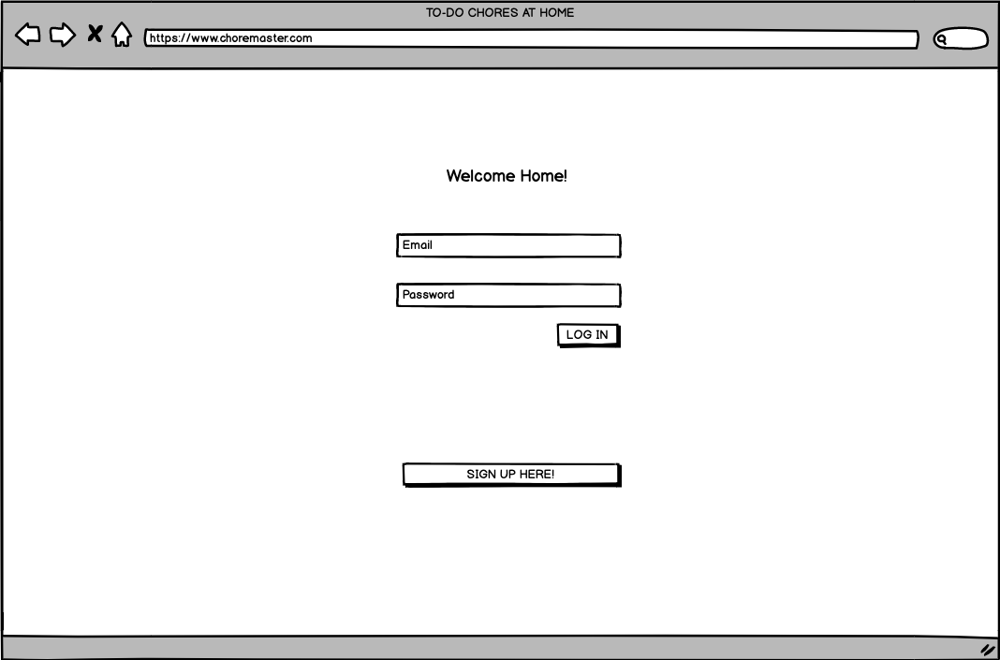
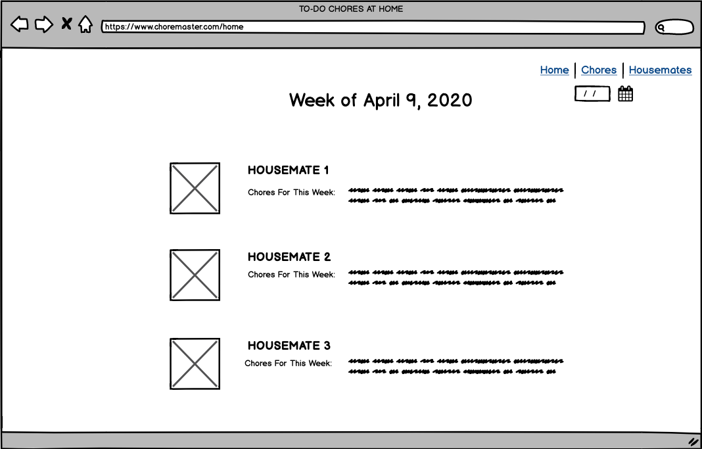
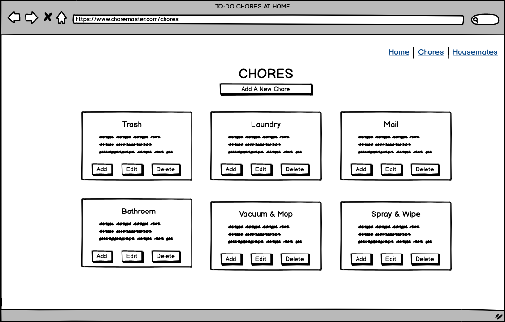
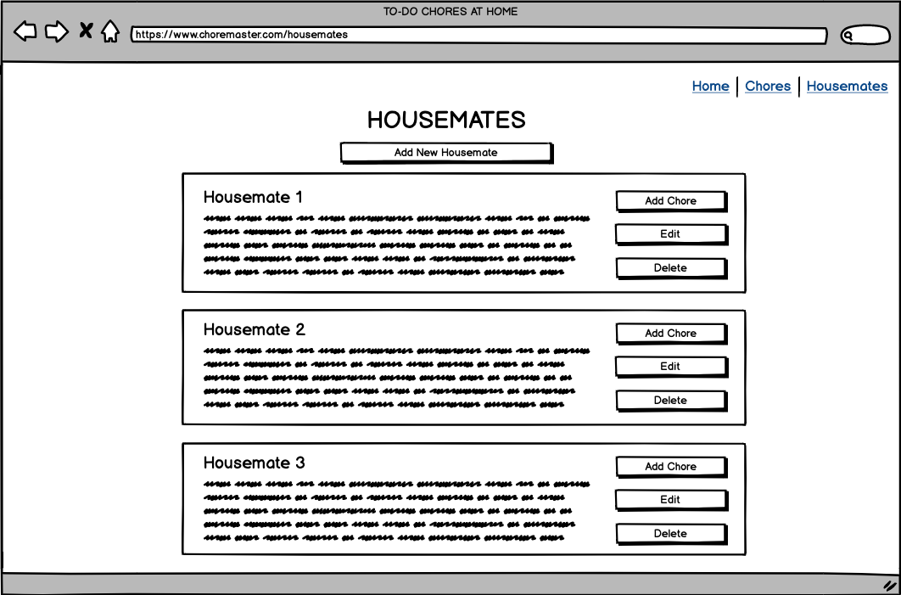
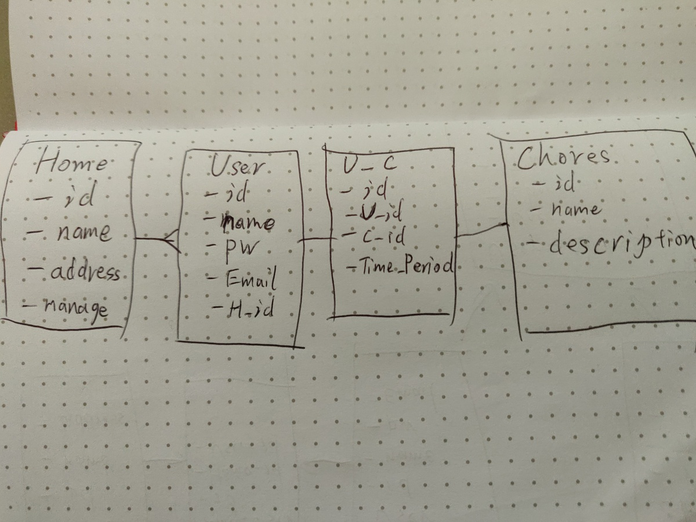

# HouseWerk

HouseWerk is an online platform for housemates and families to coordinate house chores.

## Scope

The MVP will allow users to register or log in to an existing group, view the chores that are currently assigned to them and complete chores. Admin users will be able to create a new group, add or remove group members and create/edit/delete chores. Housemates will be automatically rotated to a different set of chores each week.

## User Stories

[Trello user stories board](https://trello.com/b/XWMdduQn/user-stories)

## Wireframes

## Data Models

## Milestones

Thursday: get approval
Friday: set up auth, HTML templates, database models & seed data
Saturday: data validation, routes
Sunday: about page, user friendly URLs
Monday: full functionality, error handling
Tuesday: debugging & presentation, deploy to Heroku

## Delegating Tasks

[Trello task board](https://trello.com/b/6cTaclwp/to-dos)

